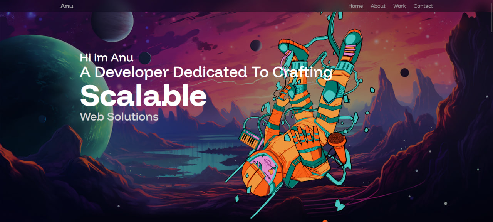

# Portfolio Website



A modern, responsive, and animated portfolio website built with **Vite + React**, styled with **Tailwind CSS**, and enhanced with **Framer Motion** for smooth animations.

I’m using this repo to track progress, make commits, and keep backups while I build.
Deployed easily on Vercel or via Docker.

## Features

- Features

- Vite + React for fast builds and dev experience

- Tailwind CSS for modern styling

- Framer Motion for animations

- Fully responsive (mobile → desktop)

- Sections for Hero, About, Projects, Experience, and Contact

- Contact form with styled UI

- Deployable with Vercel or Docker

## Tech Stack

- **Frontend:** React, JavaScript, Vite
- **Styling:** TailwindCSS / Bootstrap
- **Animations:** Framer Motion
- **Deployment:** Vercel / Docker
- **Version Control:** Git + GitHub

## Getting Started

Clone the repo:

```bash
git clone https://github.com/<your-username>/<your-repo-name>.git
cd <your-repo-name>
```

Install dependencies:

```bash
npm install
```

Start development server:

```bash
npm run dev
```

Build for production:

```bash
npm run build
npm run preview
```

Now open http://localhost:5173

## Run with Docker

Build the Docker image:

```bash
docker build -t portfolio .
```

Run the container:

```bash
docker run -p 3000:80 portfolio
```

Now open http://localhost:3000
